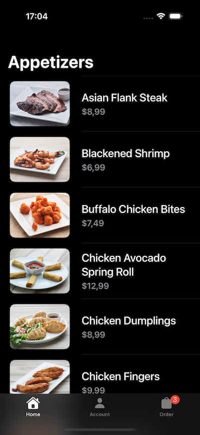
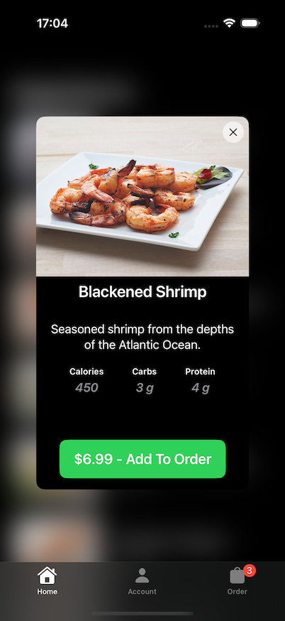
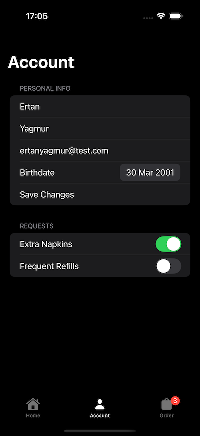
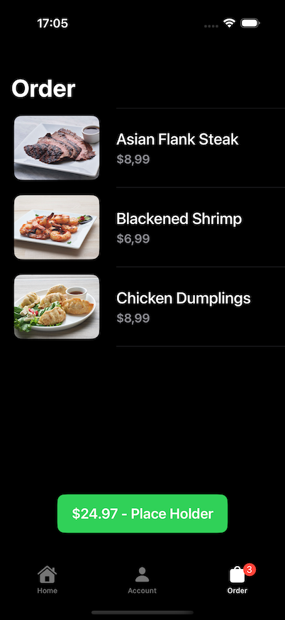

# Appetizer 
Appetizer is a project to practice and learn SwiftUI by following Sean Allen's SwiftUI Fundamentals Full Course.

## Used Techs
- SwiftUI
- Swift Concurrency
- MVVM

## Screens

## Credits
Thanks to Sean Allen for his well structured SwiftUI Fundamentals course!
